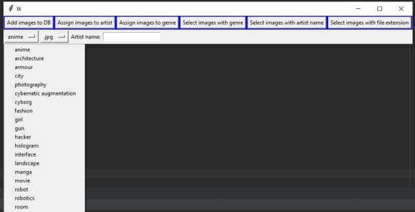
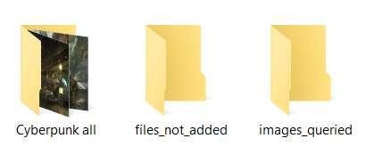

# Personal Image Info Tagger

Connects to a local database. Users can assign artists, genres, etc. to the images.  
Images can be querried by filetype, artist, genre.

## Screenshots
|||
|--|--|
|Menu||
|Folders View: "Cyberpunk all" is where all the images are located. "files_not_added" is the location where images that have not been resitered in the database are located "images_queried" is the folder where the images are copied to after the query||
